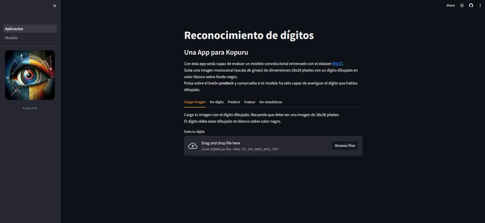
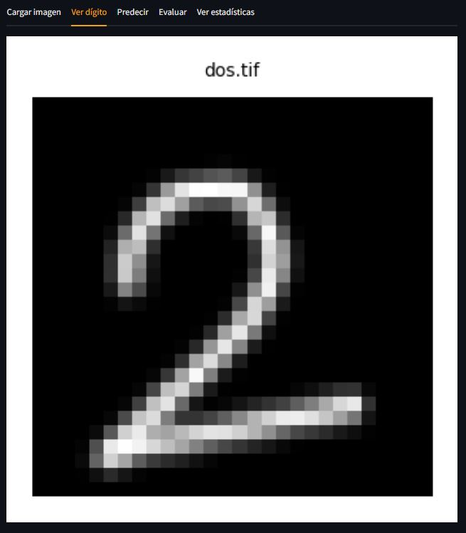
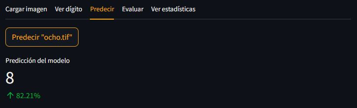
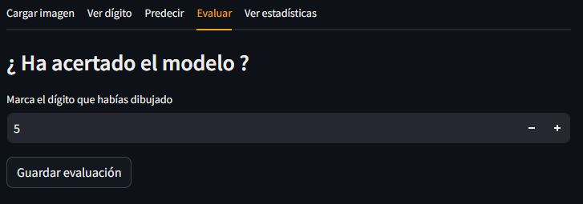
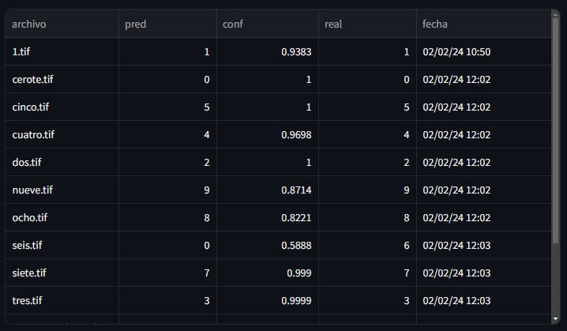
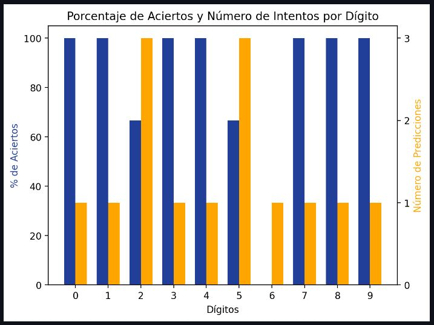

# Desarrollando y desplegando un modelo de reconocimiento de dígitos con Streamlit

En este artículo veremos cómo crear y desplegar una sencilla aplicación de reconocimiento de dígitos con **Streamlit**.

## Un poco sobre mi.
Mi nombre es Sergio Tejedor y soy un ingeniero industrial apasionado por el **Machine Learning**, la programación en **Python** y el desarrollo de aplicaciones. Actualmente soy director técnico de un grupo empresarial especializado en la laminación de perfiles en frío y fabricación de invernaderos industriales. Hace ya algo más de un año decidí dar el salto y ponerme a estudiar por mi cuenta programación. 

Escogí **Python** como lenguaje por su suave curva de aprendizaje y por ser uno de los lenguajes más utilizados en la ciencia de datos y el **Machine Learning**. Al profundizar y descubrir la gran flexibilidad de este lenguaje de programación, de entre todas sus posibilidades, decidí centrarme en el campo del **Machine Learning** ya que es aquel que más sinergias podía tener con mi formación y profesión.

## ¿ Por qué Streamlit ?
Enseguida empecé a desarrollar aplicaciones y querer compartirlas con amigos. No tardé en descubrir el framework para Python [**Streamlit**](https://streamlit.io/). Siempre había encontrado dificultades a la hora de desplegar aplicaciones (y las sigo encontrando) y es precisamente este uno de los puntos fuertes de esta librería. **Streamlit** permite crear y desplegar aplicaciones web dinámicas en las que poder compartir y visualizar tus proyectos de ciencia de datos utilizando únicamente Python y sin necesidad de conocimiento profundo de tecnologías web. De forma rápida y muy sencilla. Mediante los widgets disponibles, se pueden cargar *archivos*, *visualizar gráficos*, *dataframes* y muchas cosas más.
Tiene una comunidad creciente de usuarios y desarrolladores y una buena [documentación](https://docs.streamlit.io/library/api-reference) con ejemplos ilustrativos.

## Descripción de la app.
Las posibilidades con **Streamlit** son casi ilimitadas pero hoy abordaremos el desarrollo de una aplicación de reconocimiento de dígitos. La aplicación está disponible [aquí](https://tutorial-kopuru.streamlit.app/).

La aplicación ofrece además la posibilidad de evaluar las predicciones del modelo y mostrar una serie de estadísticas.

En definitiva, creo que es un buen ejemplo de muchas de las posibilidades que ofrece **Streamlit** a la hora de diseñar una aplicación web.

A nivel de estructura, la aplicación cuenta con 2 páginas:

La página principal, **Aplicación**, está organizada en **5 pestañas**:

### Cargar imagen

- En esta pestaña es donde el usuario podrá cargar su dígito.

### Ver dígito

- Aquí se mostrará una representación de la imagen del usuario.

### Predecir

- Mediante un botón se lanza la predicción del modelo que se mostrará más abajo.

### Evaluar

- En esta pestaña se evalúa el modelo contrastándolo con el dígito real que se pretendía dibujar y se da la posibilidad de guardar dicha evaluación.

### Ver estadísticas

- Con todas las evaluaciones guardadas se realizan algunas gráficas estadísticas.

La única página secundaria, **Modelo**, tiene detalles del modelo entrenado. Al acceder a ella se muestran en forma de *'stream'* las capas y parámetros del modelo.

## Desarrollo de la app.
Crea un nuevo proyecto en tu editor de código favorito. Personalmente uso [**Visual Studio Code**](https://code.visualstudio.com/) para desarrollar mis aplicaciones ya que lo encuentro fácil de usar y muy personalizable. La gran cantidad de extensiones disponibles facilitan mucho el desarrollo del código.

Crearemos el script **Aplicacion.py** que recogerá el código de la página principal y la carpeta **pages** con el archivo **1_Modelo.py** en su interior. Las aplicaciones multipágina en streamlit se configuran de este modo; una página inicial o principal en la ruta raiz del proyecto y todas las páginas secundarias deberán ir dentro de una carpeta **pages**. Es recomendable nombrar los scripts de las páginas secundarias con los prefijos 1_xx, 2_xx, 3_xx etc para que streamlit pueda reconocerlos correctamente.

El siguiente paso es configurar un entorno virtual e instalar las dependencias necesarias. Para proyectos en los que utilizo algún tipo de modelo de deep learning con tensorflow tengo un entorno virtual llamado **tensorflow** creado con **conda** con todos los paquetes necesarios. Puedes crear el entorno virtual usando Python en su versión 3.9 con el siguiente comando en la terminal:
 ```sh
$ conda create --name tensorflow python=3.9
```
No olvides activar el entorno virtual
```sh
$ conda activate tensorflow
```
Para este proyecto concretamente instalaremos las siguientes dependencias:
```sh
$ pip install streamlit tensorflow numpy pandas Pillow matplotlib
```
Para realizar el despliegue de la aplicación una vez hayamos terminado su desarrollo, será necesario tener una cuenta en [**GitHub**](https://github.com/) y aunque pueda hacerse al final, suele ser aconsejable iniciar **git** en el proyecto e ir guardando los avances de la aplicación en tu repositorio de GitHub.

**Streamlit** permite configurar algunos temas para toda la aplicación. Esto se realiza con un archivo **config.toml** que debe insertarse en una carpeta **.streamlit** en la rama principal de tu proyecto.

Algunas [personalizaciones](https://docs.streamlit.io/library/advanced-features/theming) posibles son: el color del texto, los colores de fondo, colores de acento y tipo de letra.
```js
[theme]
# backgroundColor="#EFF6EE"
# secondaryBackgroundColor="#aab0bd"

primaryColor="#f2a416"
base="dark" # o "light"
textColor="#EEEDEB"
font="sans serif"
```
Hasta ahora, esta es la jerarquía de archivos de nuestro proyecto:
```sh
Carpeta Principal del proyecto
├── .streamlit
│   └── config.toml
├── .git
├── pages
│   └── 1_Modelo.py
└── Aplicacion.py
```
### Script principal. Aplicacion.py
Es hora de empezar a picar el código de nuestro archivo principal: **Aplicacion.py**. Para ver el código completo de la aplicación comentado, puedes echar un vistazo a mi [repositorio](https://github.com/sertemo/tutorial-kopuru-streamlit) en github.

Casi siempre estructuro el script en varios bloques ([PEP8](https://peps.python.org/pep-0008/) para buenas prácticas en Python):
1. Importaciones, ordenadas de la siguiente manera:
    1. Librerías internas
    2. Librerías de terceros (*pip install*)
    3. Librerías o módulos de la aplicación
2. Constantes usadas en el script
3. Funciones auxiliares usadas en el script
4. Función principal **main**
5. Entry point de la app con:
    ```py
    if __name__ == '__main__':
        main()
    ```

Para poder acceder a todas las funcionalidades necesitamos importar **streamlit** con el alias **st** (esto es por convención). Aprovechamos también para importar el resto de librerías que vamos a ir necesitando:
```py
import matplotlib.pyplot as plt
import numpy as np
import pandas as pd
from PIL import Image
```

Seguidamente escribiremos la función **main** y en ella configuraremos algunos parámetros de la aplicación como el **título**, el **icono**, el tipo de **layout** y la configuración inicial de la **barra lateral**.
```py
st.set_page_config(
        page_title=f"Reconocimiento de dígitos",
        page_icon="👁️", 
        layout="centered",
        initial_sidebar_state="auto",
    )
```

**Streamlit** nos permite ir viendo el progreso de la aplicación en un servidor local de forma sencilla. Para ello simplemente debemos escribir lo siguiente en nuestra terminal:
```sh
$ streamlit run Aplicacion.py
```

Cada vez que avancemos en el código y guardemos, streamlit actualizará la visualización.

Un detalle muy importante que debemos tener en cuenta siempre que diseñemos una aplicación con **Streamlit** es que **en cada interacción del usuario con cualquier elemento de la aplicación**, los scripts se ejecutarán de arriba a abajo siempre. Esto es fundamental tenerlo claro cuando implementemos nuestra lógica, sobre todo a la hora de asignar variables. No te preocupes, **Streamlit** pone a disposición de los desarrolladores unas variables de sesión que veremos más adelante.

Debería mostrarse una [barra lateral](https://docs.streamlit.io/library/api-reference/layout/st.sidebar) con unas opciones seleccionables: **Aplicacion** y **Modelo**.

Para agregar más elementos a la barra lateral podemos hacerlo con la notación **with**:
```py
with st.sidebar:
    # Todo lo que está en el interior
    # del bloque 'with' aparecerá en la barra lateral.
```

Podemos agregar nuestra firma, una imagen o lo que nos plazca. **Streamlit** tiene varias posibilidades de [escritura](https://docs.streamlit.io/library/api-reference/text):
- **st.markdown()** : permite agregar notación **markdown** y HTML si pasamos el argumento **unsafe_allow_html**.
- **st.title()**
- **st.header()**
- **st.subheader()**
- **st.caption()** : escribe texto en letra pequeña.
- **st.code()** : escribe un bloque de código.
- **st.text()** : escribe texto plano.
- **st.latex()** : escribe texto formateado para expresiones matemáticas.

Podemos cargar una imagen de la misma manera, con la función **st.image()** y especificando la ruta del archivo.

Una vez hayamos terminado con el título y la descripción de la aplicación, incorporaremos las diferentes pestañas tal y como hemos descrito en el apartado **Descripción de la app.**

Para agregar una [pestaña](https://docs.streamlit.io/library/api-reference/layout/st.tabs), se sigue una lógica similar a la de la barra lateral. La función **st.tabs()** requiere de una lista como argumento que representa el nombre de las etiquetas de las pestañas. La función devuelve una tupla de igual longitud que la lista de nombres pasados.
```py
# Definimos las 5 tabs que tendrá nuestra app
tab_cargar_imagen, tab_ver_digito, tab_predecir, \
    tab_evaluar, tab_estadisticas = st.tabs(['Cargar imagen', 'Ver dígito', 
                                    'Predecir', 'Evaluar', 'Ver estadísticas'])
```

Los objetos devueltos por la función **st.tabs()** pueden usarse con la notación **with** para incorporar elementos dentro de cada pestaña:
```py
with tab_cargar_imagen:
    st.write('''Carga tu imagen con el dígito dibujado. 
        Recuerda que debe ser una imagen de 28x28 píxeles.<br>El dígito debe estar
        dibujado en blanco sobre color negro.''', unsafe_allow_html=True)
```
#### Pestaña Cargar imagen.
En esta primera pestaña vamos a dar la posibilidad al usuario de cargar una imagen. Realizaremos las siguientes etapas:
1. Guardar la imagen del usuario en una variable
2. Transformar la imagen en un array de **numpy**
3. Verificar que la imagen cumpla los parámetros requeridos para pasarla por nuestro modelo
4. Guardamos el nombre del archivo en sesión y mostramos mensaje de éxito

Para poder guardar el contenido de un archivo en una variable, streamlit pone a nuestra disposición la función **st.file_uploader()**. Al llamar a esta función, streamlit mostrará el widget de carga de archivos en la web.
```py
imagen_bruta = st.file_uploader(label='Sube tu dígito', type=["png","tif","jpg","bmp","jpeg"], on_change=reset_predictions)
```

Esta función nos devuelve o **None** si no hay ninguna imagen o un objeto de **UploadedFile**. El resto de lógica dentro de esta pestaña solo deberá ejecutarse **si** el usuario ha cargado una imagen. Recuerda que cada interacción del usuario con la aplicación ejecuta todos los scripts de arriba a abajo. Añadimos un bloque condicional para agrupar el resto del código de esta pestaña:
```py
if imagen_bruta is not None:
    # TODO: Transformar en array
    # TODO: Validar la imagen
    # TODO: Si no es válida detener la ejecución de la aplicación
    # TODO: Guardar nombre del archivo en sesión
    # TODO: Mostrar mensaje de éxito.
```

Para transformar los datos de la imagen en un array primero tenemos que leer el contenido del objeto **UploadedFile** que nos lo devolverá en bytes. La librería [Pillow](https://pillow.readthedocs.io/en/stable/reference/Image.html) es muy utilizada en Python para el tratamiento de imágenes y el método **open** dentro del módulo **Image** nos permite abrir la imagen pero antes es necesario envolver los bytes devueltos por el objeto UploadedFile con la clase **BytesIO** para tratar dichos bytes como si de un archivo se trataran. El código queda así:
```py
img_array = np.array(Image.open(BytesIO(imagen_bruta.read())))
```

**BytesIO** se importa de la librería **io** que viene incluida con Python.

Si la imagen cargada por el usuario no pasa nuestras funciones de validación, es apropiado mostrar un mensaje de error al usuario y detener la aplicación, de lo contrario podríamos encontrarnos con múltiples errores.
```py
if not valid_img:
    st.error(error_msg)
    st.stop() # Lo que viene después del stop no se ejecutará.
```

**Streamlit** también permite volver a ejecutar la aplicación con la función **st.rerun()**.

Para poder guardar información de manera persistente y que sobreviva a las interacciones del usuario con la aplicación, streamlit pone a nuestra disposición [**st.session_state**](https://docs.streamlit.io/library/api-reference/session-state).

**st.session_state** es un diccionario (un objeto diccionario clásico de Python) de sesión en el que podemos escribir y extraer la información que queramos. Este diccionario no se reescribe cada vez que se ejecuta el código pero sí se reinicia cuando volvemos a cargar la sesión (cuando volvemos a cargar la aplicación). Si quisiéramos que la información fuera persistente entre sesiones tendríamos que almacenarla en una base de datos. Para nuestra aplicación de hoy, st.session_state será suficiente.

Suele ser de gran ayuda también mostrar el contenido de st.session_state a medida que se desarrolla la aplicación. Para ello puedes escribir lo siguiente al principio o final de tu script:
```py
st.session_state
```

En nuestro caso guardaremos el nombre del archivo con la clave *imagen_cargada_y_validada*.
```py
# Si la imagen es válida guardamos en sesión el nombre del archivo y mostramos un mensaje de éxito
st.session_state['imagen_cargada_y_validada'] = imagen_bruta.name
# Este mensaje solo se mostrará si hay una imagen cargada y si la imagen está validada
st.success('Imagen cargada correctamente.')
```

**Streamlit** permite usar 4 tipos de [mensaje de estado](https://docs.streamlit.io/library/api-reference/status):
- **st.error()** : muestra el mensaje sobre fondo rojo.
- **st.warning()** : muestra el mensaje sobre fondo amarillo.
- **st.info()** : muestra el mensaje sobre fondo azul.
- **st.success()** : muestra el mensaje sobre fondo verde.

Todos ellos tienen la posibilidad de incluir un icono en el mensaje.

#### Pestaña Ver dígito.
Una vez terminada la implementación de la primera pestaña podemos pasar a la segunda. En esta pestaña simplemente mostraremos la imagen cargada por el usuario para poder visualizar el dígito.

**Streamlit** incorpora funciones propias para visualizar varios tipos de [gráficos](https://docs.streamlit.io/library/api-reference/charts) y además también ofrece la posibilidad de visualizar gráficos realizados con **matplotlib**. Los gráficos propios de streamlit son interactivos mientras que aquellos realizados con librerías como matplotlib se visualizan como imágenes.

Mostraremos el dígito del usuario con el siguiente código:
```py
with tab_ver_digito:
    # Verificamos que tengamos una imagen cargada y validada en sesión
    if nombre_archivo:=st.session_state.get('imagen_cargada_y_validada'):
        fig, ax = plt.subplots(figsize=(5, 2))
        ax.imshow(img_array, cmap="gray")
        ax.axis('off')
        ax.set_title(nombre_archivo, fontsize=5)
        st.pyplot(fig)
    else:
        st.info('Carga una imagen para visualizar.')
```

De nuevo, es importante tener en cuenta que cada interacción del usuario con los elementos de la aplicación hará que se ejecute todo el código. Por ello, para evitar errores, verificamos primero que exista una imagen cargada y haya sido validada. Comprobamos si en sesión existe el campo **imagen_cargada_y_validada** que hemos guardado previamente en la pestaña anterior tras realizar las validaciones. De ser así, mostramos el gráfico.

Para visualizar un gráfico de matplotlib en streamlit basta con pasarle el objeto **Figure** devuelto por **subplots** a la función **st.pyplot()**.



#### Pestaña Predecir.
Dentro de la pestaña predecir es dónde se ejecutará el modelo pre-entrenado con la imagen cargada por el usuario. El flujo de información que seguiremos con el código es el siguiente:
1. En primer lugar comprobamos si ya se ha lanzado una predicción. Para ello usaremos la misma técnica que en la pestaña precedente; comprobamos si existe una determinada clave en el diccionario de sesión **st.session_state**.
2. Si se ha lanzado ya una predicción (es decir existe la clave buscada), simplemente la mostramos en la aplicación junto a la confianza de la predicción.
3. Si no existe ninguna predicción previa:
    1. Comprobamos si existe una imagen cargada y validada, de la misma manera que en la pestaña anterior.
    2. Si existe, mostramos un botón para lanzar una predicción. Al pulsar sobre el botón:
        1. Procesamos la imagen para alimentar al modelo
        2. Lanzamos predicción del modelo y retornamos el dígito predicho y la confianza de la predicción.
        3. Mostramos el dígito y la confianza. Si la confianza es inferior al 70% se mostrará en rojo.
        4. Guardamos en sesión bajo la clave **ultima_prediccion** el dígito, la confianza y el nombre del archivo.
    3. Si no existe una imagen validada mostramos un mensaje al usuario.

**Streamlit** ofrece un formato para mostrar [métricas](https://docs.streamlit.io/library/api-reference/data/st.metric) con la función **st.metric()**. Esta función muestra una columna con 3 valores: la etiqueta, un valor en letra grande y un incremento en rojo (negativo) o verde (positivo).
```py
if (last_pred:=st.session_state.get('ultima_prediccion')) is not None:
    pred = last_pred['pred']
    conf = last_pred['conf']
    st.metric('Predicción del modelo', value=pred, delta=f"{'-' if conf < 0.7 else ''}{conf:.2%}")
```

En esta aplicación he decidido arbitrariamente poner en negativo aquellas confianzas inferiores al 70%.

Para mostrar un [botón](https://docs.streamlit.io/library/api-reference/widgets/st.button) en streamlit solo tenemos que llamar a la función **st.button()** con una etiqueta como argumento obligatorio que será el texto mostrado por el botón. Esta función devuelve **True** cuando el botón es pulsado por el usuario. En el código recogemos la salida del botón en la variable **predecir**.
```py
if nombre_imagen:=st.session_state.get('imagen_cargada_y_validada'):
    # Mostramos el botón
    predecir = st.button(f'Predecir "{nombre_imagen}"')
    # Si el usuario pulsa el botón
    if predecir:
        # Procesamos la imagen
        img_processed = process_image(img_array)
        # Lanzamos las predicciones
        with st.spinner(text='Prediciendo dígito...'):
            try:
                # La función predict nos devuelve el dígito y la confianza
                pred, conf = predict(img_processed)
                # Esperamos 1 segundo para mostrar el spinner
                time.sleep(1)
            except Exception as exc:
                # En caso de que algo haya ido mal paramos la ejecución de la aplicación
                st.error(f'Se ha producido un error al predecir: {exc}')
                st.stop()
        # Si la confianza es menor del 70% ponemos un signo menos para que streamlit lo muestre
        # en color rojo
        st.metric('Predicción del modelo', value=pred, delta=f"{'-' if conf < 0.7 else ''}{conf:.2%}")
        # Guardamos en sesión
        st.session_state['ultima_prediccion'] = {
            'pred': int(pred),
            'conf': conf,
            'archivo': nombre_imagen,
        }
```

Para hacer la aplicación más dinámica y atractiva podemos añadir un [spinner](https://docs.streamlit.io/library/api-reference/status/st.spinner) que mostrará un mensaje de ejecución mientras se está ejecutando un determinado código. Para usar un spinner tenemos que utilizar la función **st.spinner()** como un gestor de contexto, con la notación **with**. Mientras se esté ejecutando el interior del bloque **with** se mostrará el spinner.

Para utilizar el modelo he seguido los siguientes pasos:
1. Entrenar un modelo convolucional en otra plataforma y guardar sus **weights** (coeficientes) en disco. El modelo ha sido entrenado con el dataset MNIST.
2. Crear una función que devuelva un modelo con la misma arquitectura que el modelo entrenado
3. Crear una función que cargue los **weights** al modelo y lo devuelva.

Todos los scripts y objetos relacionados con el modelo se han implementado dentro de la carpeta **models**.
```sh
Carpeta Principal
├── models
│   ├── __init__.py
│   ├── convnet_mnist_104k_weights.h5
│   └── convnet_model.py
```

En este punto es especialmente relevante destacar una característica de **Streamlit** para mejorar el rendimiento de las aplicaciones. Como ya hemos visto **Streamlit** ejecuta una y otra vez los scripts lo cual puede traducirse en un tiempos de espera largos si las funciones realizan tareas pesadas. Para solucionar este contratiempo, streamlit permite usar [*caching*](https://docs.streamlit.io/library/advanced-features/caching) mediante 2 funciones:
- **st.cache_data()** : guarda información dentro de la sesión. Es la forma indicada cuando queremos guardar en caché serializable como str, int, float, DataFrame, list etc.
- **st.cache_resource()** : guarda información entre sesiones y usuarios. Es la forma indicada de almacenar modelos de ML o conexiones a bases de datos.

Para nuestra aplicación, queremos evitar que en cada ejecución se cree el modelo y se carguen sus coeficientes. Podemos utilizar la función **st.cache_resource()** como decorador de la función que carga el modelo:
```py
@st.cache_resource()
def load_model() -> keras.Model:
    """Devuelve el modelo con los weights cargados.

    Returns
    -------
    keras.Model
        El modelo con los coeficientes integrados.
    """
    # Construimos el modelo
    model = build_model()
    # Ruta a los weights del modelo
    weights = MODEL_PATH / 'convnet_mnist_104k_weights.h5'
    # Cargamos los weights
    model.load_weights(weights, by_name=True)
    return model
```

De esta manera el modelo estará disponible entre sesiones y usuarios.



#### Pestaña Evaluar.
En esta pestaña daremos la oportunidad al usuario de decirle al modelo si ha acertado o no. También implementaremos la opción de guardar las evaluaciones para realizar estadísticas en la pestaña siguiente.

El flujo de información será el siguiente:
1. Verificamos si hay una predicción guardada en sesión.
2. Si la hay, mostramos un *widget* para que el usuario introduzca el dígito dibujado.
3. Mostramos el botón de **guardar evaluación**.
4. Al pulsar sobre el botón de guardar:
    1. Comprobamos que el nombre de archivo no se haya guardado previamente (para evitar guardar la misma evaluación más de una vez).
    2. Añadimos a la clave **ultima_prediccion** el dígito real introducido por el usuario y la fecha.
    3. Añadimos el diccionario **ultima_prediccion** a una lista en sesión con la clave **historial**.
    4. Mostramos mensaje de éxito.

La función **st.number_input()** nos permite recoger un [input](https://docs.streamlit.io/library/api-reference/widgets) numérico del usuario. Se le pueden pasar como argumentos el mínimo y el máximo. En nuestro caso el valor mínimo posible es el **0** y el máximo es el **9**.
```py
digit = st.number_input('Marca el dígito que habías dibujado', min_value=0, max_value=9)
```

La clave **historial** es una lista en sesión que irá almacenando los diccionarios **ultima_prediccion** con la predicción, la confianza, el nombre del archivo, el dígito real y la fecha y hora cuando se pulsa el botón **guardar predicción**.
```py
# Verificamos si hay una predicción lanzada y guardada en sesión
if (last_pred:=st.session_state.get('ultima_prediccion')) is not None:
    ...
    # Si se pulsa el botón
    if guardar_pred:
        # Comprobamos que no hayamos guardado ya en sesión para no falsear las estadísticas
        if not pred_already_saved(last_pred['archivo']):
            # Añadimos a ultima_prediccion la evaluación del usuario
            last_pred['real'] = digit
            # Añadimos la hora
            last_pred['fecha'] = get_timestamp(DAY_HOUR_FORMAT)
            # Añadimos los valores al historial
            st.session_state['historial'].append(last_pred)
            # Mostramos mensaje de éxito
            st.success('Evaluación guardada correctamente.')

```

Sin embargo, al realizar la operación **append** la primera vez, la clave **historial** no existe en sesión y por lo tanto nos daría un error. Por ello es importante inicializar al principio de la función **main** aquellas claves en sesión que van a ser manipuladas durante la ejecución:
```py
# Inicializamos variables de sesión para llevar un registro de las predicciones
if st.session_state.get('historial') is None:
    st.session_state['historial'] = []
# Flag para saber si tenemos una imagen cargada y validada
st.session_state['imagen_cargada_y_validada'] = False
```

De esta manera, cada vez que se ejecuta el script, si la clave **historial** no existe en sesión, se crea con una lista vacía.



#### Pestaña Estadísticas.
En la pestaña **estadísticas** podemos mostrar todas las gráficas y métricas que se nos ocurran. Utilizaremos las evaluaciones guardadas en la clave **historial** de sesión para construir algunas gráficas.

Con la función **st.dataframe()** podemos visualizar [dataframes](https://docs.streamlit.io/library/api-reference/data/st.dataframe) de pandas en streamlit; Tras verificar que la clave **historial** en sesión no esté vacía, creamos un dataframe y lo visualizamos en la aplicación:
```py
with tab_estadisticas:
    # Comprobamos que haya historial guardado en sesión
    if st.session_state.get('historial'):
        # Creamos un dataframe con el historial guardado en sesión
        df = pd.DataFrame(st.session_state.get('historial'))
        # Sacamos los aciertos comparando la variable pred y real
        df['acierto'] = df['pred'] == df['real']
        ...
        # Mostramos el dataframe
        st.dataframe(df, use_container_width=True, hide_index=True, column_order=['archivo', 'pred', 'conf', 'real', 'fecha'])
```
**Streamlit** lo mostrará de esta manera:


Podemos incluso manipular el dataframe agregándole una nueva variable **acierto** que compare si la predicción del modelo es igual al dígito real.

Como ya hemos comentado en la pestaña **Ver dígitos**, **Streamlit** ofrece la posibilidad de visualizar [gráficos](https://docs.streamlit.io/library/api-reference/charts) interactivos sencillos. Podemos por ejemplo mostrar un [gráfico de líneas](https://docs.streamlit.io/library/api-reference/charts/st.line_chart) que represente la evolución de las confianzas en el eje del tiempo:
```py
# Gráfico de evolución de confianzas
st.line_chart(df, x='fecha', y='conf')
```

Las posibilidades que ofrece **Streamlit** a nivel gráfico muy diversas. Para explorar todas las posibilidades aconsejo leer la documentación. Una de ellas puede ser contrastar en un gráfico de barras el número de predicciones de cada dígito frente a su porcentaje de aciertos:


Otra opción interesante sería graficar la matriz de confusión de las evaluaciones realizadas en sesión.

### Página Secundaria. 1_Modelo.py
En esta página secundaria podemos mostrar algún detalle del modelo como por ejemplo una muestra del dataset de entrenamiento y el detalle de la arquitectura.

En esta página se mostrará todo el código del script **1_Modelo.py** incluido en la carpeta **pages**.

Para hacer el efecto de **stream**, mediante el cual van apareciendo las letras una a una, utilizamos la función [**st.empty()**](https://docs.streamlit.io/library/api-reference/layout/st.empty). Cuando se emplea con la notación **with**, todo lo que se escriba dentro del bloque será sobrescrito. Para ello iteramos sobre todos los caracteres del detalle del modelo y vamos sobrescribiendo las frases aumentando un caracter cada vez. Podemos regular la velocidad de aparición con la función **time.sleep()**.
```py
def stream_model_info() -> None:
    """Streamea la información del modelo"""
    stream_container = st.empty()
    with stream_container:
        output = ""
        for letter in get_model_summary():
            output += letter
            st.code(output)
            time.sleep(0.01)
```

Para evitar que se le haga pesado al usuario, *streameamos* la información solo 1 vez por sesión. Para ello nos valemos de una *flag* que guardamos en sesión. Dentro de la función **main** escribimos lo siguientes:
```py
if st.session_state.get('session_flag') is None:
    # Es la primera vez que entramos en la página modelo
    # asi que streameamos la info del modelo
    stream_model_info()
    # Cambiamos la flag a True
    st.session_state['session_flag'] = True
else:
    # No es la primera vez que entramos asi que
    # mostramos todo directamente
    print_model_info()
```

## Despliegue de la app.
La jerarquía de archivos del proyecto debería ser algo similar a esto:
```sh
Carpeta Principal del proyecto
├── .streamlit
│   └── config.toml
├── .git
├── pages
│   └── 1_Modelo.py
├── models
│   ├── __init__.py
│   ├── convnet_mnist_104k_weights.h5
│   └── convnet_model.py 
└── Aplicacion.py
```

Una vez hayamos revisado el código y estemos satisfecho con el resultado general de la aplicación en local, es hora de desplegarla en [Streamlit Community Cloud](https://streamlit.io/cloud).

**Streamlit** nos permite desplegar un número ilimitado de aplicaciones de forma pública. Saca el código de un repositorio de **GitHub** y lo despliega en sus servidores. **Streamlit** hace el proceso de despliegue realmente muy sencillo y rápido.
Solo necesitaremos tener una cuenta en **Streamlit Community Cloud** y **Github**.

Hecho esto, tenemos que indicar a las máquinas de streamlit qué dependencias tienen que instalar para correr la aplicación. Creamos el fichero **requirements.txt** y escribimos las librerías que hemos tenido que instalar en nuestro entorno virtual:
```sh
streamlit
tensorflow
numpy
pandas
Pillow
matplotlib
```

Con un poco de código de terminal, podemos exportar del entorno virtual de conda las dependecias directamente a un archivo **requirements.txt**:
```sh
$ conda list -e | grep -v "^#" | awk -F'=' '{print $1 "==" $2}' > requirements.txt
```

Para proyectos complejos con muchas dependencias esto puede ser de utilidad, sin embargo para un proyecto sencilla no es recomendable.


